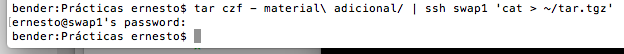
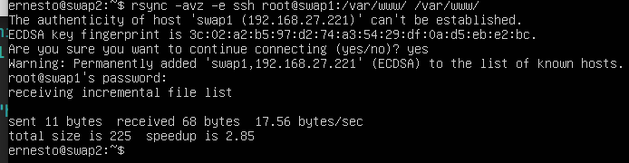
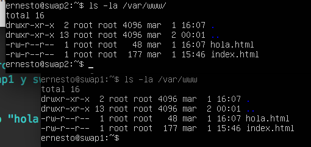
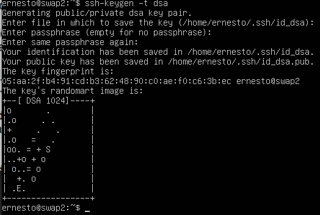
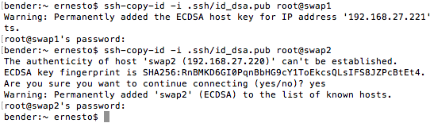

# Practica 2: Clonar la información de un sitio web

## Pasos:
### 1. Copiamos el directorio "material adicional" en la maquina swap1 (nos hemos definido la ip en el archivo hosts por comodidad) comprimido en tar.gz
```
tar czf - material\ adicional/ | ssh swap1 'cat > ~/tar.tgz'
```


### 2. Estando en la máquina *swap2* copiamos el contenido de la carpeta /var/www/ desde *swap1*
```
rsync -avz --delete -e ssh root@swap1:/var/www/ /var/www/
```


### 3. Comprobamos que en las dos máquinas tenemos lo mismo
```
ls -la /var/www
```


### 4. Generamos un par de claves dsa en nuestra maquina, y luego le pasaremos la clave publica a swap1 y swap2
```
ssh-keygen -t dsa
ssh-copy-id -i .ssh/id_dsa.pub root@swap1
```


Tip: Hemos generado tambien claves para las dos maquinas, y hemos agregado las publicas en su opuesta para poder acceder desde swap1 a swap2 y viceversa


### 5. Agregamos en el crontab de swap1 una tarea para que se sincronice con swap2
```
sudo crontab -e
```
y agregamos la siguiente linea al final del archivo
```
0 * * * * rsync -avz -e ssh root@swap1:/var/www/ /var/www/
```

Tip: Tambien podemos hacernos un script ejecutable y meterlo dentro de la directorio **/etc/cron.daily/**
