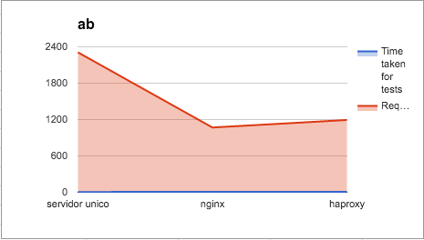
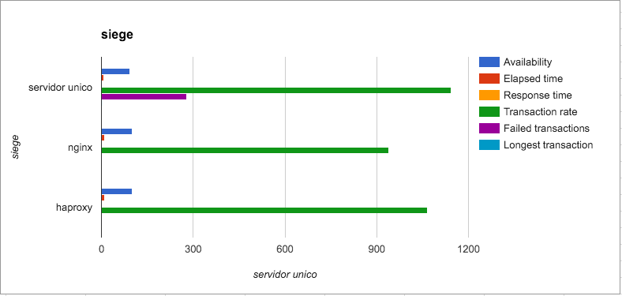
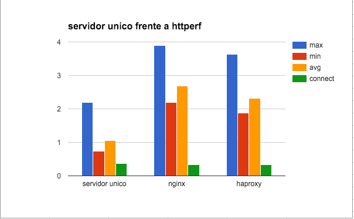

#Practica 4: Comprobar el rendimiento de servidores web

##Introducción:

Vamos a comprobar el rendimiento de mediante las herramientas ab (apache benchmark, incluido de serie en MacOSX), siege y httperf que los instalaremos mediante **brew**:
```
brew install siege httperf
```

##Toma de medidas:

Para medir vamos a lanzar cada uno de los tres programas de medida mediante un *foreach* en bash :

###Servidor solo (swap1):
```
for i in {0..9}; do ab -n 10000 -c 5 http://swap1/hola.html > datos/servidor_ab_$i.txt; done
for i in {0..9}; do siege -b -t10S http://swap1/hola.html 2> datos/servidor_siege_$i.txt; done
for i in {0..9}; do httperf --server swap1 --port 80 --num-conns 10 --rate 1 > datos/servidor_httperf_$i.txt; done
```

###nginx (swap3):
```
for i in {0..9}; do ab -n 10000 -c 5 http://swap3/hola.html > datos/nginx_ab_$i.txt; done
for i in {0..9}; do siege -b -t10S http://swap3/hola.html 2> datos/nginx_siege_$i.txt; done
for i in {0..9}; do httperf --server swap3 --port 80 --num-conns 10 --rate 1 > datos/nginx_httperf_$i.txt; done
```

###haproxy (swap3):
```
for i in {0..9}; do ab -n 10000 -c 5 http://swap3/hola.html > datos/haproxy_ab_$i.txt; done
for i in {0..9}; do siege -b -t10S http://swap3/hola.html 2> datos/haproxy_siege_$i.txt; done
for i in {0..9}; do httperf --server swap3 --port 80 --num-conns 10 --rate 1 > datos/haproxy_httperf_$i.txt; done
```

Tip: En un entorno real estas mediciones se tendrían que hacer en varios días y a poder ser con arranques en frio, pero para el objetivo de estas prácticas con lanzar la petición 10 veces nos sobraría.

##Resultados:

| ab                   | servidor unico | sd           | nginx    | sd           | haproxy  | sd           | 
|----------------------|----------------|--------------|----------|--------------|----------|--------------| 
| Time taken for tests | 4,3521         | 0,3173811063 | 9,3647   | 0,2830873638 | 8,3962   | 0,3401443484 | 
| Requests per second  | 2308,528       | 156,3097671  | 1068,738 | 31,18728645  | 1192,783 | 46,66549969  | 
| Failed requests      | 0              | 0            | 0        | 0            | 0        | 0            | 



-
| siege               | servidor unico | sd           | nginx   | sd          | haproxy  | sd           | 
|---------------------|----------------|--------------|---------|-------------|----------|--------------| 
| Availability        | 92,801         | 14,55015651  | 100     | 0           | 100      | 0            | 
| Elapsed time        | 9,029          | 1,565921135  | 10,397  | 1,552449999 | 10,366   | 1,543801801  | 
| Response time       | 0,01           | 0            | 0,018   | 0,004       | 0,01     | 0            | 
| Transaction rate    | 1143,565       | 411,0323799  | 940,399 | 114,4353902 | 1065,936 | 144,8135852  | 
| Failed transactions | 279,1          | 434,3386812  | 0       | 0           | 0        | 0            | 
| Longest transaction | 1,152          | 0,7753296073 | 0,211   | 0,178742832 | 0,109    | 0,0262488095 | 


-
| httperf | servidor unico | sd            | nginx | sd            | haproxy | sd            | 
|---------|----------------|---------------|-------|---------------|---------|---------------| 
| max     | 2,2            | 1,428285686   | 3,89  | 1,201341842   | 3,63    | 2,581149615   | 
| min     | 0,74           | 0,04898979486 | 2,19  | 0,1577973384  | 1,88    | 0,1469693846  | 
| avg     | 1,05           | 0,1565247584  | 2,68  | 0,2675817632  | 2,31    | 0,4060788101  | 
| connect | 0,37           | 0,09          | 0,33  | 0,06403124237 | 0,33    | 0,04582575695 | 




-
##Conclusiones:
Vemos como por un lado **ab** no nos muestra una prueba real de carga, y que solo mide el tiempo de conexión que evidentemente será mas rapido en el servidor local ya que es conexión directa sin tener que pasar por el balanceador, en cambio con los otros dos programas si que notamos como el balanceador hace que se reduzca el numero de transacciones fallidas así como soportar mayor numero de conexiones al tener los servidor menos *estrés*.

###NOTA: Hemos creado una hoja de cálculo en Google Docs para generar los gráficos y hacer los calculos de medias y desviación estandar, dicha hoja se puede consultar [aqui](https://docs.google.com/spreadsheets/d/18kRAeQu0oNr6V8-98WCG7J4v1M8NhWuzwsuBlzH07pU/edit?usp=sharing)