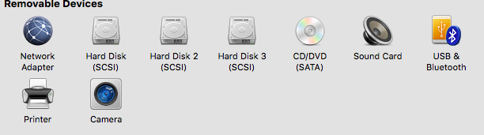

#Practica 6: Discos en RAID

##Tarea a realizar:

1. Realizar la configuración de dos discos en RAID 1 bajo Ubuntu 12.04, automatizando el montaje del dispositivo creado al inicio del sistema.
2. Simular un fallo en uno de los discos del RAID (mediante comandos con el mdadm), retirarlo “en caliente”, comprobar que se puede acceder a la información que hay almacenada en el RAID, y por último, añadirlo al conjunto y comprobar que se reconstruye correctamente.
3. Realizar una configuración de servidor NFS. La idea es que la máquina con el dispositivo RAID sea un servidor NFS y otra máquina monte dicha unidad usando este protocolo.

-

Agregamos dos discos de 1GB a la máquina *swap3* desde la configuración VMware Fusion



Comprobamos con **fdisk -l** que los discos son reconocidos por el sistema

```
ernesto@swap3:~$ sudo fdisk -l

Disk /dev/sda: 21.5 GB, 21474836480 bytes
255 heads, 63 sectors/track, 2610 cylinders, total 41943040 sectors
Units = sectors of 1 * 512 = 512 bytes
Sector size (logical/physical): 512 bytes / 512 bytes
I/O size (minimum/optimal): 512 bytes / 512 bytes
Disk identifier: 0x00086ff8

   Device Boot      Start         End      Blocks   Id  System
/dev/sda1   *        2048    39845887    19921920   83  Linux
/dev/sda2        39847934    41940991     1046529    5  Extended
/dev/sda5        39847936    41940991     1046528   82  Linux swap / Solaris

Disk /dev/sdb: 1073 MB, 1073741824 bytes
255 heads, 63 sectors/track, 130 cylinders, total 2097152 sectors
Units = sectors of 1 * 512 = 512 bytes
Sector size (logical/physical): 512 bytes / 512 bytes
I/O size (minimum/optimal): 512 bytes / 512 bytes
Disk identifier: 0x00000000

Disk /dev/sdb doesn't contain a valid partition table

Disk /dev/sdc: 1073 MB, 1073741824 bytes
255 heads, 63 sectors/track, 130 cylinders, total 2097152 sectors
Units = sectors of 1 * 512 = 512 bytes
Sector size (logical/physical): 512 bytes / 512 bytes
I/O size (minimum/optimal): 512 bytes / 512 bytes
Disk identifier: 0x00000000

Disk /dev/sdc doesn't contain a valid partition table
```

Instalamos **mdadm**, creamos el raid con los discos **sdb** y **sdc**, de damos formato y lo montamos en **/dat** (finalmente comprobamos que está correctamente montado 

<pre>
ernesto@swap3:~$ sudo apt-get install mdadm

sudo mdadm -C /dev/md0 --level=raid1 --raid-devices=2 /dev/sdb /dev/sdc

sudo mkfs /dev/md0
sudo mkdir /dat
sudo mount /dev/md0 /dat

ernesto@swap3:~$ sudo mount
/dev/sda1 on / type ext4 (rw,errors=remount-ro)
proc on /proc type proc (rw,noexec,nosuid,nodev)
sysfs on /sys type sysfs (rw,noexec,nosuid,nodev)
none on /sys/fs/fuse/connections type fusectl (rw)
none on /sys/kernel/debug type debugfs (rw)
none on /sys/kernel/security type securityfs (rw)
udev on /dev type devtmpfs (rw,mode=0755)
devpts on /dev/pts type devpts (rw,noexec,nosuid,gid=5,mode=0620)
tmpfs on /run type tmpfs (rw,noexec,nosuid,size=10%,mode=0755)
none on /run/lock type tmpfs (rw,noexec,nosuid,nodev,size=5242880)
none on /run/shm type tmpfs (rw,nosuid,nodev)
<b>/dev/md0 on /dat type ext2 (rw)</b>

ernesto@swap3:~$ sudo mdadm --detail /dev/md0
/dev/md0:
        Version : 1.2
  Creation Time : Sat Mar 19 00:31:56 2016
     Raid Level : raid1
     Array Size : 1048000 (1023.61 MiB 1073.15 MB)
  Used Dev Size : 1048000 (1023.61 MiB 1073.15 MB)
   Raid Devices : 2
  Total Devices : 2
    Persistence : Superblock is persistent

    Update Time : Sat Mar 19 00:33:50 2016
          State : <b>clean</b>
 Active Devices : 2
Working Devices : 2
 Failed Devices : 0
  Spare Devices : 0

           Name : swap3:0  (local to host swap3)
           UUID : 4fec84c6:39a83f6d:481a7230:3daac47d
         Events : 17

    Number   Major   Minor   RaidDevice State
       0       8       16        0      active sync   /dev/sdb
       1       8       32        1      active sync   /dev/sdc

</pre>

Obtenemos el UUID del disco para agregar la linea correspondiendte al **fstab**

<pre>
ernesto@swap3:~$ ls -l /dev/disk/by-uuid/
total 0
lrwxrwxrwx 1 root root 10 Mar 19 00:29 0a2a203e-0e4c-41bf-b58e-23271b7a033a -> ../../sda1
lrwxrwxrwx 1 root root 10 Mar 19 00:29 5e97ec6d-8eaf-4cb0-932d-65b3478abc81 -> ../../sda5
<b>lrwxrwxrwx 1 root root  9 Mar 19 00:32 8b5301df-ee10-454c-858a-9a8c8cbe2347 -> ../../md0</b>
</pre>

Agregamos esta línea al fichero **/etc/fstab**

```
UUID=8b5301df-ee10-454c-858a-9a8c8cbe2347 /dat ext2 defaults 0 0
```
 
-

Simulamos un fallo y comprobamos el estado del RAID

<pre>
ernesto@swap3:~$ sudo mdadm --manage --set-faulty /dev/md0 /dev/sdb
ernesto@swap3:~$ sudo mdadm --detail /dev/md0
/dev/md0:
        Version : 1.2
  Creation Time : Sat Mar 19 00:31:56 2016
     Raid Level : raid1
     Array Size : 1048000 (1023.61 MiB 1073.15 MB)
  Used Dev Size : 1048000 (1023.61 MiB 1073.15 MB)
   Raid Devices : 2
  Total Devices : 2
    Persistence : Superblock is persistent

    Update Time : Sat Mar 19 00:40:19 2016
          State : <b>clean, degraded</b>
 Active Devices : 1
Working Devices : 1
<b> Failed Devices : 1</b>
  Spare Devices : 0

           Name : swap3:0  (local to host swap3)
           UUID : 4fec84c6:39a83f6d:481a7230:3daac47d
         Events : 19

    Number   Major   Minor   RaidDevice State
       0       0        0        0      removed
       1       8       32        1      active sync   /dev/sdc

      <b> 0       8       16        -      faulty spare   /dev/sdb</b>
</pre>

Quitamos el disco y comprobamos el estado del RAID

<pre>
ernesto@swap3:~$ sudo mdadm --manage --remove /dev/md0 /dev/sdb
mdadm: hot removed /dev/sdb from /dev/md0
ernesto@swap3:~$ sudo mdadm --detail /dev/md0
/dev/md0:
        Version : 1.2
  Creation Time : Sat Mar 19 00:31:56 2016
     Raid Level : raid1
     Array Size : 1048000 (1023.61 MiB 1073.15 MB)
  Used Dev Size : 1048000 (1023.61 MiB 1073.15 MB)
   Raid Devices : 2
 <b> Total Devices : 1</b>
    Persistence : Superblock is persistent

    Update Time : Sat Mar 19 00:41:36 2016
          State : <b>clean, degraded</b>
 Active Devices : 1
Working Devices : 1
 Failed Devices : 0
  Spare Devices : 0

           Name : swap3:0  (local to host swap3)
           UUID : 4fec84c6:39a83f6d:481a7230:3daac47d
         Events : 20

    Number   Major   Minor   RaidDevice State
       0       0        0        0      removed
       1       8       32        1      active sync   /dev/sdc

</pre>

Agregamos un  nuevo disco (notese que se está reconstruyendo el espejo)

<pre>
ernesto@swap3:~$ sudo mdadm --manage --add /dev/md0 /dev/sdb
mdadm: added /dev/sdb
ernesto@swap3:~$ sudo mdadm --detail /dev/md0
/dev/md0:
        Version : 1.2
  Creation Time : Sat Mar 19 00:31:56 2016
     Raid Level : raid1
     Array Size : 1048000 (1023.61 MiB 1073.15 MB)
  Used Dev Size : 1048000 (1023.61 MiB 1073.15 MB)
   Raid Devices : 2
  Total Devices : 2
    Persistence : Superblock is persistent

    Update Time : Sat Mar 19 00:42:46 2016
          State : <b>clean, degraded, recovering</b>
 Active Devices : 1
Working Devices : 2
 Failed Devices : 0
  Spare Devices : 1

<b> Rebuild Status : 57% complete</b>

           Name : swap3:0  (local to host swap3)
           UUID : 4fec84c6:39a83f6d:481a7230:3daac47d
         Events : 31

    Number   Major   Minor   RaidDevice State
       2       8       16        0      spare rebuilding   /dev/sdb
       1       8       32        1      active sync   /dev/sdc

</pre>

-

Configuramos un servidor NFS en el directorio **/dat** en **swap3**

```
sudo apt-get install nfs-kernel-server
ernesto@swap3:~$ sudo chown nobody:nogroup /dat/
sudo vim /etc/exports
/dat        swap1(rw,sync,no_subtree_check)
sudo exportfs -a
```

Montamos el servidor NFS en **swap1**

```
ernesto@swap1:~$ sudo apt-get install nfs-common
ernesto@swap1:~$ sudo mkdir /dat
sudo mount swap3:/dat /dat
ernesto@swap1:~$ df -h
Filesystem      Size  Used Avail Use% Mounted on
/dev/sda1        19G  1.2G   17G   7% /
udev            492M  4.0K  492M   1% /dev
tmpfs           101M  312K  100M   1% /run
none            5.0M     0  5.0M   0% /run/lock
none            501M     0  501M   0% /run/shm
swap3:/dat     1008M  1.3M  955M   1% /dat
```